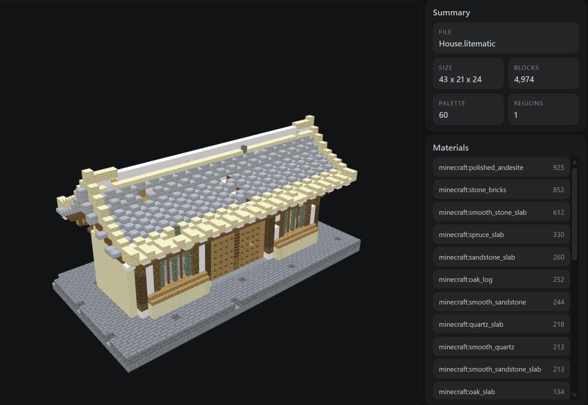

# Minecraft Schematic Viewer for VS Code

Visual Studio Code extension previews Minecraft schematic files directly in an editor tab.

Currently supported formats:

- `.litematic`
- `.schem`
- `.nbt`
- `.mcstructure`
- Building Gadgets `.json`




## Installation
Get it by simply searching **Minecraft Schematic Viewer** in your extensions tab, or find it at [VS Code Marketplace](https://marketplace.visualstudio.com/items?itemName=jacklitstar.minecraft-schematic-viewer) and [Open VSX](https://open-vsx.org/extension/jacklitstar/minecraft-schematic-viewer). You can also download the latest release from the Github [Releases Page](https://github.com/jacklitstar/vscode-litematic-viewer/releases), drag and drop the `.vsix` file into your VS Code extensions tab.

## Usage

Open a supported schematic file in VS Code, and the extension will preview it in a new tab.

- `.litematic`, `.schem`, `.nbt`, and `.mcstructure` open directly with the viewer.
- Building Gadgets `.json` files are available through **Reopen With...** / **Open With...** so the extension does not take over regular JSON editing.

Use your mouse to navigate the schematic, and use the scroll wheel to zoom in and out. Use `WASD` or arrow keys to pan the camera.

### Resource packs

Open a schematic and click **Open Packs Folder** in the Resource Pack section, or run **Minecraft Schematic Viewer: Open Resource Packs Folder** from the Command Palette. Put standard Minecraft resource pack ZIP files or extracted pack folders there. You can also put ZIP packs beside the schematic file. An extracted pack must contain `pack.mcmeta` and an `assets` directory at its top level; a ZIP must contain them at the ZIP root. Click **Refresh** after adding or changing packs, then choose one from the selector. To keep large schematic directories responsive, the viewer skips nearby ZIP discovery when that directory has more than 1,000 ZIP files; packs in **Packs Folder** remain available.

The viewer uses the selected pack's block textures, block models, and blockstates over its bundled vanilla resources. The selection is saved for the schematic's parent folder and updates other open schematics in that same folder. Schematics in other folders start with **Vanilla**. Resource pack textures are fitted into the viewer's 16-pixel atlas slots, and animated textures show their first frame.

## Development

Run this command from the extension project folder:

```bash
npm run build
```

This builds both the extension host bundle and the webview bundle into `dist/`.


## License

This project is licensed under `AGPL-3.0`.

## Disclaimer

This extension is an independent, unofficial project. It is not affiliated with, endorsed by, sponsored by, or otherwise related to Minecraft®, Mojang Studios, Microsoft, or any of their affiliates.

# ✨
Star this repository on [Github](https://github.com/jacklitstar/vscode-litematic-viewer) to show your support!

Vibe coded and LGTM by jacklitstar.
